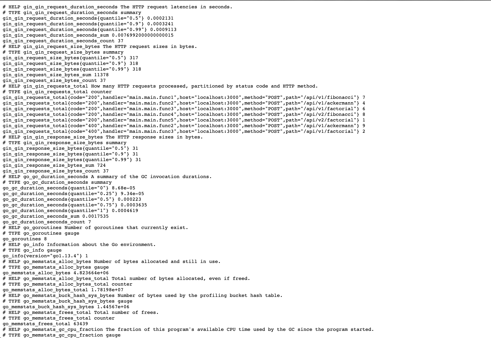
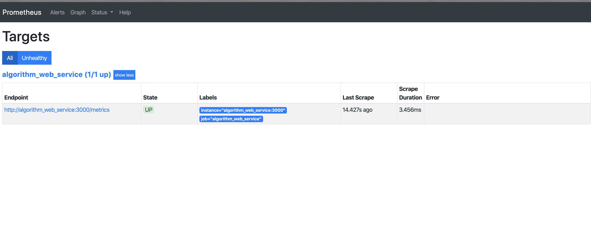
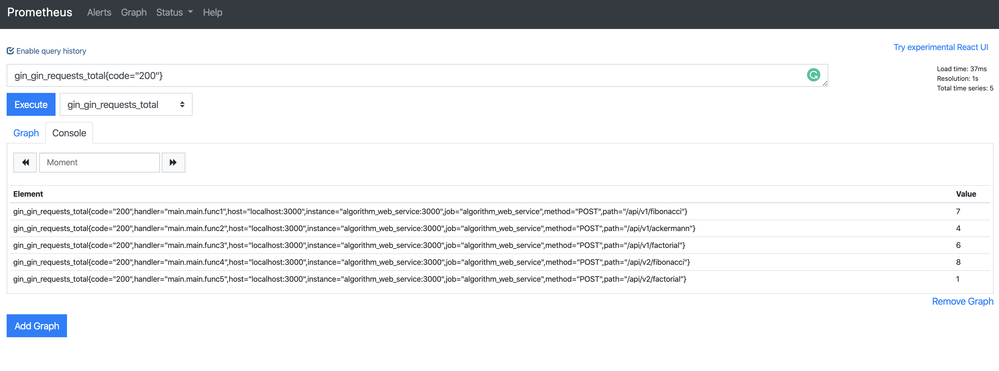
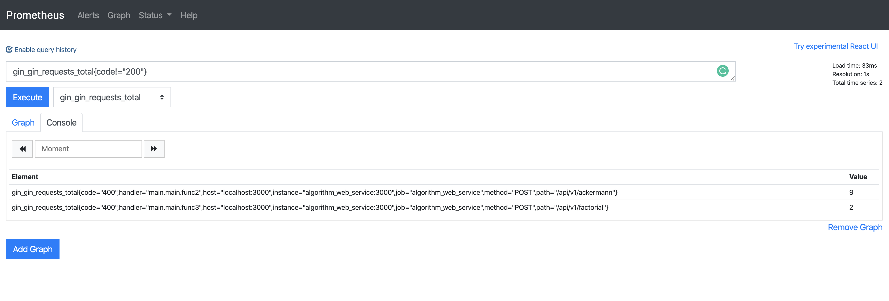
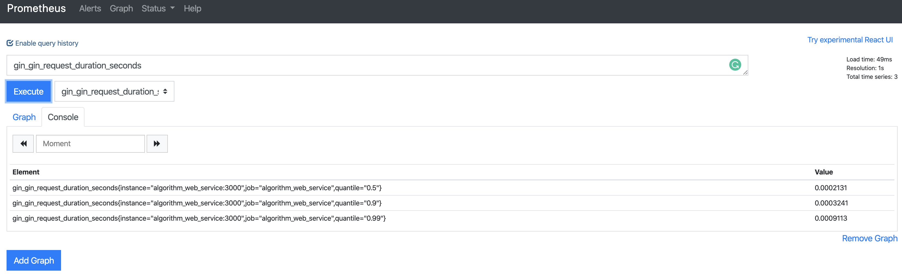
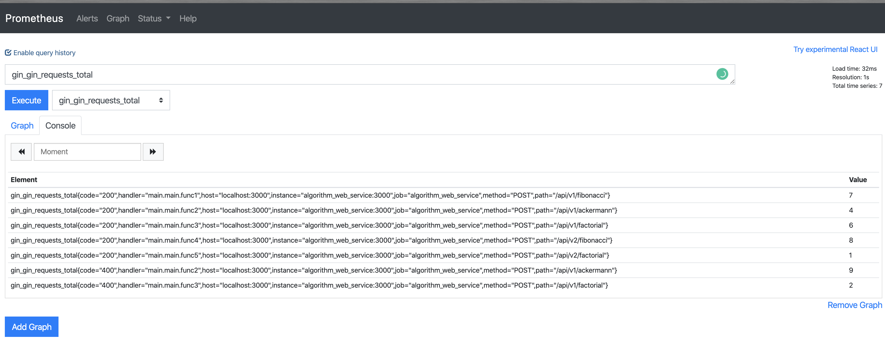
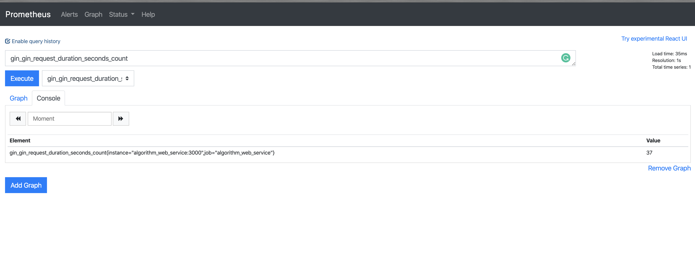

# Web service implementing selected algorithms 
## Algorithms implemented
- Fibonacci series: https://en.wikipedia.org/wiki/Fibonacci_number
- Ackermann function: https://en.wikipedia.org/wiki/Ackermann_function
- Factorial: https://en.wikipedia.org/wiki/Factorial

# Technologies used
```
- Golang (version 1.12)
- Gin (HTTP webserver)
- Prometheus
```

The application has been configured to run on port 3000. The endpoints can accessed by making a POST request to any of the endpoints mentioned in the [API list](#API-list) section.
Sample application endpoint: localhost:3000/api/v1/fibonacci

# Usage
*Run this code locally*
1. Clone this repository unto your PC
2. Ensure you have `docker`, `docker-compose`, the `Go` binary (version 1.11+ required) and the `make` command-line utility installed on your PC.
3. Run `make run` to run the code locally and start up the web server. \
`make run` downloads the required dependencies, builds the binary and starts up the webserver on port 3000.

*Run this code using docker and docker-compose*
1. Run `make compose-build` to start up docker containers using docker-compose. This starts up two docker containers running the algorithm web service and a prometheus server which monitors the algorithm web service.

Run `make help` for a list of help messages using `make`
```
Usage: make <target>
  mod-download  download modules to local cache
  build       build binary for local OS
  build-linux  build linux binary
  run         build and run app locally
  test        run tests
  bench       run benchmark and unittests
  clean       run benchmark and unittests
  compose-up  Create and start containers
  compose-down  Stop and remove containers, networks, images, and volumes
  compose-restart  restart services
  compose-tail  Tail output from containers
  compose-build  Build or rebuild services
  compose-top  Display the running processes
  compose-ps  List containers
```

# Run Unittests 
- `make test` \
output:
```
go test -v
=== RUN   TestSimpleFib
--- PASS: TestSimpleFib (0.00s)
=== RUN   TestOptimizedFib
--- PASS: TestOptimizedFib (0.00s)
=== RUN   TestSimpleAckermann
--- PASS: TestSimpleAckermann (0.00s)
=== RUN   TestSimpleFactorial
--- PASS: TestSimpleFactorial (0.00s)
=== RUN   TestOptimizedFactorial
--- PASS: TestOptimizedFactorial (0.00s)
PASS
ok      algorithm_web_service   0.398s
```

# Run Benchmark tests
`make bench` \
output:
```
go test -bench=.
goos: darwin
goarch: amd64
pkg: algorithm_web_service
BenchmarkSimpleFib10-12                  5000000               347 ns/op
BenchmarkOptimizedFib10-12              10000000               119 ns/op
BenchmarkSimpleFib20-12                    30000             42289 ns/op
BenchmarkOptimizedFib20-12              10000000               182 ns/op
BenchmarkSimpleFibneg20-12                 20000             63764 ns/op
BenchmarkOptimizedFibneg20-12           100000000               10.5 ns/op
BenchmarkSimpleAckermann33-12             200000              7302 ns/op
BenchmarkSimpleFactorial1000-12           500000              3256 ns/op
BenchmarkOptimizedFactorial1000-12       2000000               757 ns/op
BenchmarkSimpleFactorial5000-12           100000             16261 ns/op
BenchmarkOptimizedFactorial5000-12        500000              3962 ns/op
PASS
ok      algorithm_web_service   20.110s
```
# APIs implemented using the POST method 
Each algorithm mentioned above was implemented using two different APIs (/api/v1 and /api/v2). 

The `/api/v1` endpoints represent unoptimized implementations of the algorithms. \
The `/api/v2` endpoints represent the optimized implementations of the algorithms.

# API list
```
Unoptimized APIs
/api/v1/fibonnaci
/api/v1/ackermann
/api/v1/factorial

Optimized APIs
/api/v2/fibonnaci
/api/v2/factorial
```

# Make API requests 
Solve Ackermann function with two variables: /api/v1/ackermann
```json
curl -X POST \
  http://localhost:3000/api/v1/ackermann/ \
  -H 'Content-Type: application/json' \
  -d '{
	"m": "0",
	"n": "52"
}'
response:
{
    "result": 53
}
```

# Postman collection with sample API requests
A Postman collection with sample definitions, requests and responses has been included in this repo. The location of the Postman collection is `doc/postman`.

Import the collection into postman to use the sample requests with the application.

# Monitoring
Prometheus was chosen as the monitoring solution due to its minimal overhead with regards to metrics collection. Follow this [url](https://prometheus.io/) to learn more about prometheus. \
Prometheus was added as a service in the `docker-compose.yml` file provided in this repo. It has been configured to run on port 9090.

Prometheus can be accessed on http://localhost:9090 once the docker-compose.yml file is applied. The metrics exposed by the application can also be accessed via http://localhost:3000/metrics.

## Metrics measured
The main metrics configured to be measured by Prometheus are application uptime, request latency, request errors and volume of traffic.

**Exposed Application metrics**


#### Overview of currently monitored services



## Queries to retrieve Application metrics on Prometheus
* All HTTP 200 requests

* All non HTTP 200 requests

* Duration of requests in seconds

* Number of requests segmented by endpoint

* Total number of requests



# Improvements
* Implement the optimized version of the Ackermann function
* Implement the use of the `go context` package to manage cancellation and timeout of requests.
* Implement tests for the APIs